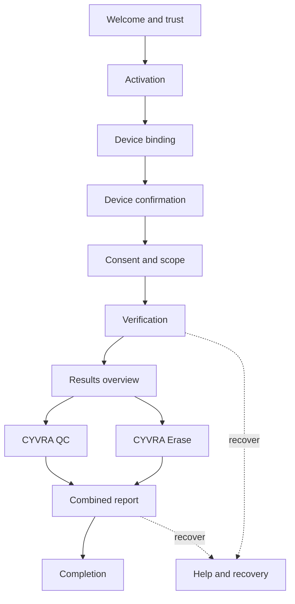

# CYVORIQ ERASE — W2.1A GUI Visual Design Package — 2026-08-24

> **Status:** OWNER APPROVED — FREEZE EFFECTIVE ON MERGE OF PR #30
>
> **Approval:** Owner visually reviewed the repository-local prototype and approved all 20 decisions in Section 29 on 2026-08-24.
>
> **Branch:** `w2-1a-gui-visual-design`
>
> **Repository baseline:** `0b27b42e221632a42ef06055bb3a7fd9b94b42e5`
>
> **Scope:** Information architecture, screen inventory, visual system, interaction states, customer copy, accessibility requirements and a repository-local clickable prototype for the shared CYVRA Windows application.
>
> **Change boundary:** This package authorizes no deployment, production GUI implementation, collector execution, activation, device binding, report issuance, database mutation, secret change, signing operation, destructive erasure, public distribution or customer release.

## 1. Purpose and precedence

This package translates the approved product and grading contracts into a reviewable Windows desktop experience before Tauri implementation begins.

It must be read with:

- [W2.1 Shared Customer GUI/UX Contract](w2-1-shared-customer-gui-ux-contract-2026-08-24.md);
- [W2.2 CYVRA QC Grading Contract](w2-2-cyvra-qc-grading-contract-2026-08-24.md);
- [Current Product Freeze and Team Handoff](current-product-freeze-handoff-2026-08-21.md);
- [W1.1 Desktop, Installer and Hardware Freeze](w1-1-desktop-installer-hardware-freeze-2026-08-21.md); and
- [Frontend Commercial V1 Freeze](frontend-commercial-v1-freeze.md).

The approved product, privacy, safety, entitlement, device-binding, grading and report contracts take precedence over visual convenience.

The package is a design decision record, not a substitute for production threat modeling, API contracts, typed schemas, implementation tests or release approval.

## 2. Design outcome

CYVRA V1 uses one customer application:

`CYVRA Erase — by CYVORIQ Solutions`

Inside it, customers receive two clearly separated result domains:

| Domain | Customer outcome | Permanent boundary |
| --- | --- | --- |
| CYVRA QC | Evidence-based device condition and an A–E grade when issuance requirements are met | A grade is not a resale price, valuation or warranty |
| CYVRA Erase | Privacy Exposure Map, exposure assessment and erasure-readiness evidence | V1 assesses only; it does not erase data |

CYVRA QC is not a second application, installer, sign-in, activation, binding or scan.

## 3. Experience principles

The visual experience must be:

- evidence-led rather than decorative;
- calm and credible rather than fear-based;
- clear to an individual customer and efficient for enterprise, OEM and ITAD users;
- truthful about completed work, missing evidence and permission limits;
- safe under cancellation, network interruption and partial collector failure;
- usable by keyboard, screen reader and Windows display scaling;
- consistent with the CYVORIQ public brand; and
- explicit about the difference between specification, condition, privacy exposure and erasure status.

The design must never invent hardware values, imply a collector is still progressing when it is not, treat unavailable evidence as failed hardware or present an unauthenticated report as verified.

## 4. Information architecture



After activation the persistent primary navigation is:

1. Overview
2. Verification
3. Results
4. Report
5. Help

Settings and privacy are secondary. They must not compete with the verification journey.

## 5. Frozen customer journey

The high-fidelity happy path is:

1. Establish publisher and product trust.
2. Sign in or activate through a server-authoritative route.
3. Read and accept the one-device binding disclosure.
4. Confirm the detected device.
5. Review collection scope and explicit exclusions.
6. Give unselected, explicit consent.
7. Start one coordinated verification.
8. Follow truthful, stage-based progress.
9. Review the overall outcome and limitations.
10. Review the CYVRA QC grade and supporting evidence.
11. Review the CYVRA Erase privacy exposure and readiness evidence.
12. Preview one combined report.
13. Complete safely and retain verification instructions.

At every recoverable failure, the application states what happened, what remains safe and what action is available.

## 6. Complete screen inventory

| ID | Screen | Purpose | Dominant action | Required alternate states |
| --- | --- | --- | --- | --- |
| S01 | Welcome and Trust | Establish product and publisher trust | Continue | Offline notice, unsupported OS |
| S02 | Sign In or Activate | Establish an authorized entitlement | Continue securely | Invalid, expired, revoked, unavailable, network recovery |
| S03 | Device-Binding Disclosure | Explain one-entitlement/one-device binding | Agree and bind | Declined, same-device revalidation, different-device conflict |
| S04 | Device Detected | Confirm the intended computer | Confirm device | Incorrect device, masked identifier unavailable |
| S05 | Consent and Scope | Explain reads, exclusions and evidence use | Give consent | Consent not selected, optional evidence declined |
| S06 | Ready to Verify | Present final scope and safe expectations | Run Device Verification | Permission limitation notice |
| S07 | Verification Progress | Show real stages and bounded cancellation | Cancel safely | Running, limited, error, cancelling, cancelled |
| S08 | Overview | Provide the calm returning-customer home | Run Device Verification | Never run, report ready, unresolved limitation |
| S09 | Results Overview | Summarize both result domains | Review CYVRA QC | Complete, limited, unable to grade |
| S10 | CYVRA QC Results | Explain grade, evidence, dimensions and caps | Continue to CYVRA Erase | Pending, A–E, insufficient evidence, grading error, review required |
| S11 | CYVRA Erase Results | Explain privacy exposure and readiness | Continue to report | Limited coverage, permission denied, collection error |
| S12 | Combined Report Preview | Review the single evidence package | Prepare report | Authentication pending, verified, failed, unavailable |
| S13 | Completion | Confirm safe completion and next steps | Finish | Local-only result, report verification unavailable |
| S14 | Help and Recovery | Resolve bounded, privacy-safe problems | Retry safely | Support path, diagnostic code, no-network path |

These fourteen screens are available in the repository-local prototype through the screen selector.

## 7. Low-fidelity layout model

The prototype includes a `Show wireframe` control. Wireframe mode removes brand polish while preserving hierarchy, spacing, screen regions and state behavior.

| Region | Desktop placement | Contents | Behavior |
| --- | --- | --- | --- |
| Windows title bar | Full width, top | Approved logo, product identity, prototype/build context, window controls | Persistent |
| Primary navigation | Left rail | Five frozen destinations and trust status | Persistent after activation |
| Workspace header | Main column, top | Section eyebrow, screen title and current device | Persistent context |
| Screen canvas | Main column, center | Screen-specific hierarchy and actions | Scrolls independently when needed |
| Safety footer | Main column, bottom | Assessment ID, execution context and non-destructive status | Persistent where window height permits |
| Modal layer | Centered over window | Cancellation or blocking recovery decision | Traps focus in production implementation |
| Prototype controls | Outside app frame | Screen, scenario, wireframe and contrast selection | Review-only; excluded from product |

The first customer-visible focus is the screen heading. The dominant action is positioned after the information needed to make that decision.

## 8. Window and responsive layout

The production target is a resizable Windows desktop window, not a browser dashboard.

| Condition | Design treatment |
| --- | --- |
| Reference minimum | Content remains usable at 1366 × 768 at 100% scaling |
| Recommended opening size | Approximately 1180 × 760 logical pixels, bounded by available work area |
| Large displays | Main reading region stays constrained; evidence tables may use additional width |
| 125% and 150% scaling | Two-column panels collapse before text or controls clip |
| 200% scaling | Navigation becomes compact and content becomes a single readable column |
| Narrow review viewport | Sidebar converts to a compact horizontal navigation pattern |
| Long values | Wrap safely with label preserved; never overflow the window |
| Vertical overflow | Workspace content scrolls; title and navigation remain understandable |

No customer decision may require hover. No essential evidence may be hidden only because the window is narrower.

## 9. Approved visual foundation proposed by W2.1A

The palette is derived from the existing CYVORIQ public interface and approved logo asset.

### 9.1 Core tokens

| Token | Value | Role |
| --- | --- | --- |
| `--brand-navy` | `#06295F` | Title, navigation, strongest brand foundation |
| `--brand-navy-deep` | `#041A3D` | High-emphasis text and dark surfaces |
| `--brand-blue` | `#0F7AC8` | Informational emphasis and selected navigation |
| `--brand-cyan` | `#27B6E6` | Supporting accent, charts and progress detail |
| `--brand-orange` | `#EE6B00` | Brand accent and non-text emphasis |
| `--action-orange` | `#C95000` | Highest-intent primary button with white text |
| `--action-orange-hover` | `#A84300` | Primary-button hover and pressed state |
| `--ink` | `#152238` | Main body text |
| `--muted` | `#5F6F86` | Secondary copy on light surfaces |
| `--border` | `#DFE7F0` | Dividers and input boundaries |
| `--surface` | `#F6F9FC` | Neutral page surface |
| `--surface-blue` | `#EEF6FC` | Selected and informative surfaces |
| `--white` | `#FFFFFF` | Main panels and reverse text |

White text is not placed on `#EE6B00` for small controls because that pairing does not meet the target contrast. The darker `#C95000` action token provides at least 4.5:1 contrast with white for standard text. The bright orange remains a brand accent.

### 9.2 Semantic status tokens

| State | Color role | Required companion |
| --- | --- | --- |
| Success / complete | Green | Check icon and explicit label |
| Information / running | Blue | Stage label and current-state text |
| Warning / limited | Amber | Warning icon and limitation copy |
| Error / blocked | Red | Error icon, message and recovery action |
| Unknown / unavailable | Neutral slate | Exact evidence status label |

Color is never the only status cue.

### 9.3 Typography

The proposed production stack is:

`Segoe UI Variable, Segoe UI, Inter, system-ui, sans-serif`

| Style | Size target | Weight | Use |
| --- | ---: | ---: | --- |
| Display | 32–38 px | 700 | Welcome and major outcomes |
| Screen heading | 26–30 px | 700 | Workspace title |
| Section heading | 18–22 px | 650–700 | Evidence groups |
| Body | 15–16 px | 400 | Customer explanations |
| Label | 12–13 px | 650–700 | Metadata and uppercase eyebrow text |
| Evidence value | 14–16 px | 550–650 | Scannable facts |
| Fine print | 12–13 px | 400 | Supporting notices, never critical consent |

Line height is at least 1.45 for customer copy. All-caps is limited to short labels.

### 9.4 Spacing, shape and depth

- Base spacing unit: 4 px.
- Common gaps: 8, 12, 16, 24, 32 and 48 px.
- Standard control height: at least 44 px.
- Standard card radius: 14 px.
- Compact input and status radius: 8–10 px.
- Pill radius is reserved for compact statuses, not general containers.
- Shadows are subtle and limited to window depth, dialogs and elevated decisions.
- Borders remain visible without relying on shadow.

## 10. Iconography, imagery and brand use

- Use `frontend/public/cyvoriq-logo.webp` in the product title area.
- Do not recreate the logo as initials, a shield or a letter icon.
- Use a consistent outline icon family in production.
- Every important icon has adjacent text or an accessible name.
- Avoid stock cybersecurity imagery, dramatic locks, anonymous hacker visuals and decorative device photography inside task flows.
- Grade letters are text, not image assets.

The prototype uses simple text glyphs only as temporary design markers. Production icons require a licensed, consistent asset set and accessible labeling.

## 11. Component library

### 11.1 Buttons

| Variant | Use | Rules |
| --- | --- | --- |
| Primary | One highest-intent action per decision region | Accessible dark orange, action-specific label |
| Secondary | Safe alternate or back action | White or pale surface with strong border |
| Quiet | Non-critical disclosure or navigation | Text and icon, visible focus |
| Danger | Confirm safe cancellation or destructive-to-session action | Red semantics; never used for data erasure in V1 |

Disabled buttons retain readable labels and provide nearby guidance. Loading buttons preserve width and expose a text status.

### 11.2 Inputs

- Labels remain visible outside the field.
- Activation keys are masked after entry.
- Errors do not reveal whether an unrelated identity or key exists.
- Consent checkboxes are never preselected.
- Focus, error, success and disabled states are visually distinct and announced.
- Paste is permitted where security policy allows; secret values never enter logs.

### 11.3 Cards and evidence rows

Cards group one decision or evidence category. They must not create a wall of equal visual weight.

Evidence rows preserve:

- customer-friendly label;
- value or explicit state;
- provenance;
- timestamp;
- confidence where applicable;
- permission state; and
- schema or rules version in the detail view.

### 11.4 Status chips

Approved customer-facing evidence labels include:

- Reported
- Observed
- Derived
- Unknown
- Not reported
- Not applicable
- Permission denied
- Unsupported
- Collection error

Unknown, restricted or unsupported data is never styled as hardware failure.

### 11.5 Progress stages

Each stage has pending, running, completed, completed-with-limitations, cancelled and collection-error treatments. Running state may animate subtly when reduced motion is not requested.

### 11.6 Dialogs and notices

Blocking dialogs contain:

- a concrete title;
- one-paragraph impact explanation;
- safe default action;
- explicit alternate action; and
- predictable keyboard behavior.

Informational notices do not imitate errors. Permanent safety boundaries remain visible in their relevant result and report screens.

## 12. Welcome and activation design

### S01 — Welcome and Trust

The screen shows:

- approved logo and product identity;
- publisher `CYVORIQ Solutions`;
- current application version;
- signed-package expectation;
- standard-user and non-destructive statement; and
- a single `Continue` action.

Proposed headline:

`Know the device. Understand the exposure. Preserve the evidence.`

### S02 — Sign In or Activate

The screen presents the approved email sign-in and/or activation-key route without implying local entitlement authority.

Required supporting copy:

`CYVRA verifies your entitlement securely. Activation details are never used as normal API credentials.`

Network failure copy:

`We could not verify your entitlement because the service is unavailable. Nothing changed on this device. Check your connection and retry.`

## 13. Binding, device and consent design

### S03 — Device-Binding Disclosure

Show one-entitlement/one-device behavior before agreement. Describe input categories, pseudonymous treatment and audited support recovery without exposing fingerprint internals.

Different-device copy:

`This entitlement is already bound to another device. No verification was started. Contact support for an authorized recovery review.`

### S04 — Device Detected

Show manufacturer, model, Windows edition, architecture and masked identity only where approved evidence supports them.

Primary prompt:

`Is this the device you want to assess?`

### S05 — Consent and Scope

Separate what CYVRA reads from what it never reads.

In-scope examples:

- passive hardware facts;
- approved functional evidence;
- data-location category metadata;
- permission and coverage states; and
- evidence timestamps and versions.

Explicit exclusions:

- personal file contents and filenames;
- message, email and browser-history contents;
- passwords, tokens, keys and recovery material;
- camera or microphone activation; and
- destructive data changes.

Consent text:

`I understand the assessment scope and consent to this passive, non-destructive verification.`

## 14. Ready and progress design

### S06 — Ready to Verify

Summarize device, requested scope, known stages, expected permission behavior and cancellation availability. The primary action is:

`Run Device Verification`

### S07 — Verification Progress

The eight frozen stages are:

1. Preparing verification
2. Confirming device identity
3. Collecting passive hardware information
4. Assessing personal-data locations
5. Building the Privacy Exposure Map
6. Preparing evidence
7. Verifying consistency
8. Preparing results

A percentage appears only when derived from known completed units. Otherwise, the current stage and completed-stage count are sufficient.

Cancellation opens a confirmation dialog with `Continue verification` as the safe default and `Cancel safely` as the explicit alternate.

After confirmation the state becomes `Cancelling safely`. No new collector starts, bounded shutdown completes, approved partial evidence is preserved, and no completed grade or report is issued.

## 15. Overview and results summary design

### S08 — Overview

The overview is a task-oriented home, not an analytics dashboard. It shows:

- current device;
- entitlement and binding status;
- last verification date;
- report availability;
- unresolved limitations; and
- one dominant `Run Device Verification` action.

### S09 — Results Overview

The screen first states whether verification completed, completed with limitations or stopped.

Two visually separate summaries follow:

- CYVRA QC grade state, evidence coverage and material limitation count; and
- CYVRA Erase exposure state, assessed category coverage and no-erasure notice.

The summaries link into detail; they do not flatten both domains into one score.

## 16. CYVRA QC result design

### 16.1 Grade presentation

When issued, the grade block contains:

- letter and descriptor together, such as `Grade B — Good`;
- assessment date;
- device profile;
- evidence coverage;
- grading-rules version;
- evidence-manifest reference;
- applied caps; and
- material limitations.

The permanent notice is:

`CYVRA QC Grade describes assessed device condition at the recorded assessment time. It is not a resale valuation or warranty.`

### 16.2 Grade states

| Lifecycle | Customer treatment |
| --- | --- |
| Before completion | `Grade pending` with current requirement |
| Awaiting human review | `Grade pending — review required` with expected next action |
| Issued A–E | Letter, descriptor, evidence coverage, dimensions and limitations |
| Insufficient evidence | `Unable to grade — insufficient evidence` plus named missing categories |
| Grading error | `Unable to grade — grading error` plus safe retry or support action |
| Superseded | Link to current revision and preserve original assessment record |

`Grade not issued` is not a customer-release default.

### 16.3 Dimension presentation

Use the six approved dimensions:

| Dimension | Weight | Visual result |
| --- | ---: | --- |
| Core system operation | 30 | Outcome, coverage and critical limitations |
| Integrated display and input | 20 | Outcome and supporting functional evidence |
| Storage condition | 10 | Read-only state and limitations |
| Battery and power | 15 | Derived health evidence and cap if applied |
| Connectivity, ports and audio | 10 | Approved checks and unknowns |
| Cosmetic and structural condition | 15 | Reviewed evidence and structural concerns |

The customer view emphasizes outcomes and evidence, not false score precision. Internal basis points do not become a decorative consumer score.

### 16.4 Limits and caps

Any cap appears next to the resulting grade with:

- condition that triggered it;
- maximum grade or review action;
- linked evidence; and
- rules version.

A safety concern or identity/evidence conflict blocks issuance rather than being visually hidden in a footnote.

## 17. CYVRA Erase result design

### S11 — CYVRA Erase Results

The result uses a Privacy Exposure Map organized by category and evidence coverage. It may show:

- profile and volume coverage;
- data-location and application-data categories;
- metadata-based findings;
- assessed and unassessed areas;
- permission limitations;
- consistency status; and
- erasure-readiness guidance.

It must not show personal content, filenames, message bodies, browser-history content, passwords, keys, screenshots or raw sensitive samples.

The permanent result notice is:

`No data was erased. This assessment identifies exposure and prepares evidence for an authorized next step.`

The word `secure` must not be used as a blanket outcome when limitations remain.

## 18. Combined report preview

### S12 — Combined Report Preview

The report visibly separates:

1. Device specification
2. CYVRA QC condition grade
3. CYVRA Erase privacy exposure
4. Erasure status
5. Scope and limitations
6. Evidence provenance and versions
7. Authenticity status and verification instructions

Authenticity states are:

| State | Label | Action |
| --- | --- | --- |
| Not requested | `Authentication not started` | Prepare report |
| Service processing | `Authenticity verification pending` | Wait or return safely |
| Verified | `Authenticated report` | Save and verify |
| Service unavailable | `Local results — authentication unavailable` | Retry without duplicating report |
| Integrity failure | `Report not verified` | Do not issue; show support code |

The preview must never look authenticated before cryptographic or server verification actually succeeds.

## 19. Completion and help

### S13 — Completion

Show:

- whether an authenticated report is available;
- saved location or explicit local-only state;
- verification method;
- assessment date;
- report and grade revision; and
- recommended next action.

### S14 — Help and Recovery

Support content uses privacy-safe diagnostic codes. A support bundle must follow its separate approved observability contract and must never include raw identifiers, activation keys or personal content.

The customer can retry only the bounded failed action when safe. Retrying must not duplicate activation, evidence, grade or report transactions.

## 20. Error and recovery matrix

| Condition | Headline | Safety statement | Primary recovery |
| --- | --- | --- | --- |
| No network before activation | `We could not verify entitlement` | Nothing changed on the device | Retry connection |
| Worker unavailable | `Verification service is unavailable` | Local assessment has not started or remains safely paused | Retry safely |
| Invalid or unavailable entitlement | `We could not complete activation` | No unrelated account or key detail is exposed | Review entry or contact support |
| Different device detected | `This entitlement is bound to another device` | No scan started | Authorized recovery review |
| Permission declined | `Some information is unavailable` | Remaining passive checks may continue | Continue with limitation or retry permission |
| Collector timeout | `One check did not finish` | Other collectors remain isolated | Retry affected check |
| Collector parse error | `One result could not be interpreted` | No value was invented | Continue with collection error |
| Customer cancellation | `Verification cancelled safely` | No final grade or completed report was issued | Start again or exit |
| Insufficient grading evidence | `Unable to grade — insufficient evidence` | Existing evidence remains recorded | Supply approved missing evidence |
| Review pending | `Grade pending — review required` | No grade has been guessed | Wait or review status |
| Report authentication failure | `Report not verified` | Local results remain visibly unverified | Retry or contact support |
| Unexpected error | `CYVRA could not complete this step` | Privacy-safe error code only | Retry, restart or support |

## 21. State behavior

Every asynchronous customer action defines:

- idle;
- focused;
- validating;
- in progress;
- succeeded;
- succeeded with limitations;
- recoverable failure;
- blocking failure;
- cancelling;
- cancelled; and
- disabled states where applicable.

The GUI must not clear a useful error merely because focus moves. It must not leave stale success text after inputs change.

## 22. Customer copy rules

- Prefer concrete verbs: `Verify`, `Review`, `Continue`, `Retry`, `Save`.
- Avoid ambiguous verbs: `Submit`, `Go`, `Process`.
- Use `verification`, not `scan`, when referring to the complete coordinated journey; `scan` may describe an internal bounded stage.
- Say `permission denied`, `unsupported` or `collection error` instead of `failed hardware` when that is the actual state.
- Say `unable to grade`, never `Grade F`.
- Say `No data was erased`, never imply sanitization occurred.
- Do not promise compliance, resale value or warranty.
- Do not expose raw JSON, stack traces, internal endpoints or fingerprint inputs.

## 23. Core copy deck

| Context | Approved candidate copy |
| --- | --- |
| Product safety | `Passive, non-destructive verification` |
| Consent | `I understand the assessment scope and consent to this passive, non-destructive verification.` |
| Start | `Run Device Verification` |
| Progress cancel | `Cancel safely` |
| QC issued | `Grade B — Good` or corresponding approved A–E descriptor |
| QC pending | `Grade pending` |
| QC pending review | `Grade pending — review required` |
| QC missing evidence | `Unable to grade — insufficient evidence` |
| QC service failure | `Unable to grade — grading error` |
| Grade boundary | `This grade describes assessed condition. It is not a resale valuation or warranty.` |
| Erase boundary | `No data was erased. This assessment identifies exposure and prepares evidence for an authorized next step.` |
| Report pending | `Authenticity verification pending` |
| Report verified | `Authenticated report` |
| Safe cancellation | `Verification cancelled safely. No final grade or completed report was issued.` |

Final legal, privacy and support copy remains subject to the relevant contract owners.

## 24. Accessibility specification

The design targets WCAG 2.2 AA principles where applicable to a Windows desktop application.

### 24.1 Keyboard and focus

- Every function is keyboard-operable.
- Focus order follows visual and decision order.
- Focus is never trapped outside a modal; production dialogs contain a deliberate focus trap and restoration.
- Visible focus uses a high-contrast outline with sufficient offset.
- Escape closes only dismissible overlays and never silently cancels work.
- Skip navigation is available where a persistent sidebar precedes the main screen.

### 24.2 Screen readers and announcements

- Screen headings are programmatically identifiable.
- Current navigation uses an accessible current-state attribute.
- Progress changes use polite announcements; blocking errors use assertive treatment only when necessary.
- Grade letters include their descriptor and are not announced as an isolated character.
- Evidence tables retain headers and meaningful reading order.
- Icons do not replace accessible text.

### 24.3 Visual access

- Standard text contrast is at least 4.5:1.
- Large text and non-text controls meet applicable AA contrast.
- Focus indicators remain visible in Windows high contrast.
- Status never depends on color alone.
- Text remains usable at 200% scaling without two-dimensional scrolling for primary tasks.
- Reduced-motion preference disables non-essential transitions.

### 24.4 Target size and errors

- Primary controls target at least 44 × 44 logical pixels.
- Compact Windows controls retain an equivalent accessible hit area where possible.
- Error text identifies the field and recovery action.
- Consent, grade limitations and no-erasure statements are not relegated to low-contrast fine print.

## 25. Windows 10 and Windows 11 review

The same Tauri application experience is targeted on supported Windows 10 22H2 x64 and Windows 11 x64 systems.

| Review item | Windows 10 | Windows 11 |
| --- | --- | --- |
| Typography | Segoe-compatible and legible | Segoe UI Variable when available, safe fallback |
| Window controls | Native behavior and hit targets | Native behavior and hit targets |
| Corners | Application surfaces remain coherent without OS rounded corners | Compatible with rounded window treatment |
| Scaling | Review at 100%, 125%, 150% and 200% | Review at 100%, 125%, 150% and 200% |
| High contrast | Required | Required |
| Keyboard and Narrator | Required physical validation | Required physical validation |
| Reduced motion | Respect system preference | Respect system preference |

The design does not require Mica, Acrylic or a Windows 11-only API. Platform decoration may enhance Windows 11 but must not change information or actions.

## 26. Motion specification

- Screen transitions: 120–180 ms fade/translate at most.
- Progress changes: discrete stage transition, not looping fake progress.
- Success emphasis: one short transition, no confetti.
- Error emphasis: no shaking or flashing.
- Reduced motion: transitions become immediate.
- Loading indicators stop when work stops and include an adjacent text state.

## 27. Prototype package

The review prototype is located at:

`docs/design/w2-1a/prototype/`

From the repository root, run:

```bash
python3 -m http.server 4173 --directory /workspaces/Erase
```

Then open:

`/docs/design/w2-1a/prototype/`

The prototype provides:

- all fourteen screens;
- complete, excellent, insufficient-evidence and network-recovery scenarios;
- Grade A and Grade B issued examples;
- pending and unable-to-grade treatments;
- the CYVRA Erase Privacy Exposure Map;
- combined report authenticity states;
- safe cancellation behavior;
- wireframe mode;
- high-contrast preview; and
- responsive layout review.

The prototype uses static sample data, has no API calls and performs no customer or device operation.

## 28. Prototype exclusions

The prototype does not prove:

- Tauri implementation feasibility;
- Windows native accessibility-tree behavior;
- collector integration;
- activation or binding security;
- deterministic grade calculation;
- report signing or authentication;
- database or Worker behavior;
- installer layout;
- Windows physical-device compatibility; or
- customer-release readiness.

Those require separate implementation and validation gates.

## 29. Owner-approved design decisions

The owner approved the following decisions after local prototype review on 2026-08-24:

1. One shared application and five-item primary navigation.
2. Fourteen-screen inventory and journey order.
3. Logo placement and product naming.
4. Navy/blue foundation and controlled orange action role.
5. Light-theme first release.
6. Desktop frame, sidebar and workspace hierarchy.
7. Welcome and activation tone.
8. Consent scope and explicit exclusions.
9. Stage-based progress and safe-cancel dialog.
10. Results overview separation between QC and Erase.
11. A–E CYVRA QC grade presentation.
12. Dimension evidence, limitations and caps presentation.
13. Unable-to-grade and review-pending states.
14. CYVRA Erase Privacy Exposure Map presentation.
15. Permanent no-erasure statement.
16. Combined report separation and authenticity states.
17. Error and recovery language.
18. Core customer copy deck.
19. Accessibility requirements.
20. Windows 10/11 and display-scaling behavior.

The approval becomes the W2.1A visual freeze when PR #30 is merged. It does not approve production implementation or customer release.

## 30. Required validation before implementation approval

Before production GUI implementation is accepted, the design must be validated through:

- keyboard-only task walkthrough;
- Narrator or equivalent screen-reader review;
- automated accessibility checks where applicable;
- contrast verification for every token combination;
- 100%, 125%, 150% and 200% display-scaling review;
- 1366 × 768 minimum-layout review;
- Windows 10 physical layout review;
- Windows 11 physical layout review;
- long-value, localization-expansion and error-copy stress tests;
- cancellation and recovery task tests; and
- owner review of all issued, pending and unable-to-grade states.

## 31. Handoff to production implementation

After owner approval and merge, the implementation branch must:

1. create the Tauri 2 application shell behind the frozen reusable Rust boundary;
2. encode visual tokens centrally rather than duplicating them across screens;
3. implement semantic components and all required states;
4. connect only to approved typed commands and schemas;
5. preserve standard-user and non-destructive behavior;
6. add accessibility and visual regression tests;
7. keep prototype controls and sample data out of customer packaging; and
8. stop if a product, privacy, grading, report or security contract is incomplete.

## 32. Explicit non-goals

This package does not authorize:

- destructive erasure;
- password or security-control bypass;
- public download or customer installation;
- unsigned packaging;
- production Cloudflare, Neon, Resend or R2 changes;
- live activation or entitlement decisions;
- device fingerprint implementation;
- grade calculation or issuance;
- report authentication;
- customer-media upload;
- automated media grading;
- resale valuation or auction pricing;
- Windows Server support;
- offline grading; or
- go-live approval.

## 33. Change control

After approval, material changes to navigation, screen inventory, visual tokens, grade presentation, no-erasure messaging, authenticity states or accessibility behavior require a reviewed, versioned amendment.

Every implementation handoff must record:

- branch and base commit;
- frozen design requirement addressed;
- files and components changed;
- privacy and security impact;
- accessibility and Windows validation;
- tests and evidence;
- deployment performed or explicitly not performed;
- rollback method;
- open risks; and
- next approval gate.

## 34. Immediate next action after approval

Complete the independent review and required checks on PR #30, then merge only after explicit merge authorization.

After merge, plan the first bounded Tauri shell implementation branch against this frozen design package and the approved W2.1 and W2.2 contracts.

No production deployment or customer release is authorized by W2.1A.
